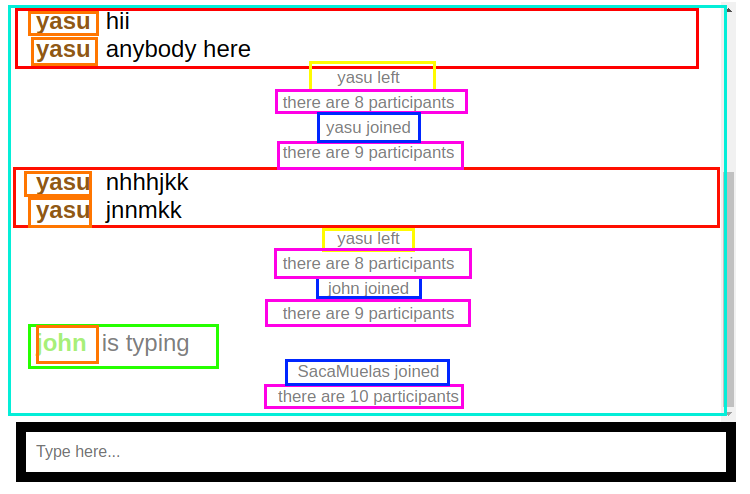

# Chat

## Available Scripts

### `npm start`

Runs the app in the development mode.
Open http://localhost:8080 to view it in the browser.

The page will reload if you make edits.
You will also see any lint errors in the console.

### `npm test`

Launches the test runner

### `npm run build`

Builds the app for production to the build folder.
It correctly bundles React in production mode and optimizes the build for the best performance.

The build is minified and the filenames include the hashes.

### `npm run format`

Format your code according to our style guide

### `npm run lint`

Show linting errors

### `npm run build-css`

Build CSS files and put them near SCSS files

### `npm run watch-css`

Run build `build-css` in watch mode

## Requirements

Try to create small components so they are easy to test.

### /chat

Under `/chat` you should create chat page. It will looks like this:

You can think of that each colored box is separate component.

The chat window consist of two components:

-  Messages
-  New message input

Messages components of bunch of other components:

-  Message
-  User left notification
-  Participants count
-  User joined notification
-  User
-  User is typing message

Components can be designed as you like. Beautiful design and animations is a plus.

### User stories

#### User should be able to add a new message.

1. When user types a text in the `New message input` and then press `Enter` key a new message should be send using `chat.addMessage(message)`.
2. When user tries to send empty or a message with only spaces user should see error message: "Message cannot be empty".
3. When message is sent user should see it in the `Messages` list with the her username and the text of the message.

#### User should be able to see other users' messages

1. When some other user adds message it should be shown in the messages list with his username and message text.

#### User should be able to see if someone is typing

1. When some other user is typing `User is typing` message should be shown.
2. If user stops typing in `400` milliseconds `User is typing` message should be disappeared.

#### User should be notified when someone joins the chat

1. When some user joins the chat the current user should see `User joined notification` and `Participants count`.
2. User should see `User joined notification` with her username when she joins the chat herself.

#### User should be notified when someone leaves the chat

1. When some user leaves the chat the current user should see `User left notification` and `Participants count`.

#### User should be able to scroll the chat

1. When messages doesn't fit in the screen a scroll should appear.

#### User should see her messages on the bottom of the chat

1. When user adds a message the `Messages` list should be scrolled to the bottom, so user can see it immediately see it.

### Other requirements

- Each point of the user story should have test case (`it` block).
- Beautiful design is a plus
- Small components is a plus
- Presentations and container components separation is a big plus

